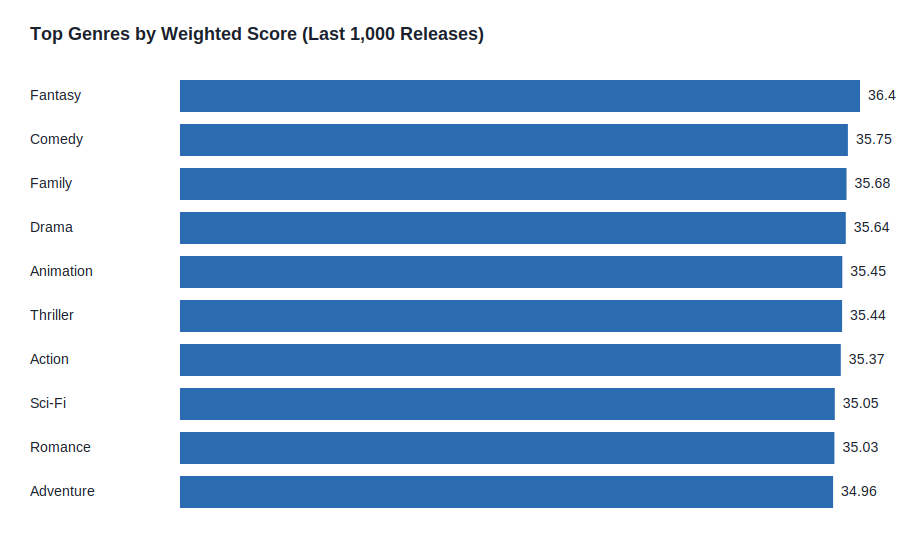

# Executive Summary: Genre Performance Analysis (Most Recent 1,000 Releases)

**Objective:** Identify the most promising movie genre for the next release based on performance signals from the most recent 1,000 films in the dataset, using ratings and audience engagement (votes) as proxies for success.

**Data Source:** See `data/README.md` for dataset provenance and limitations.

---

## Board-Level Findings

1. **Fantasy leads the composite performance score** in the most recent 1,000 films analyzed, narrowly outperforming Comedy, Family, and Drama. The top cluster of genres is tightly grouped, indicating a competitive landscape rather than a single runaway winner.
2. **High-performing genres combine strong ratings with broad engagement.** Genres with solid average ratings but lower audience participation fall behind once engagement is weighted in.
3. **A portfolio approach is recommended**—favoring Fantasy/Comedy/Family in the near term while validating sub-genre execution (e.g., family-friendly fantasy or adventure-comedy hybrids) to capture both critical approval and audience scale.

---

## Evidence Snapshot

**Top 10 Genres by Weighted Score (Avg Rating × log10 Avg Votes)**

| Rank | Genre | Titles | Avg Rating | Median Rating | Avg Votes | Weighted Score |
| ---: | :---- | -----: | ---------: | ------------: | --------: | -------------: |
| 1 | Fantasy | 149 | 6.76 | 6.80 | 242,483 | 36.40 |
| 2 | Comedy | 161 | 6.67 | 6.80 | 227,958 | 35.75 |
| 3 | Family | 155 | 6.60 | 6.50 | 252,897 | 35.68 |
| 4 | Drama | 170 | 6.63 | 6.65 | 239,549 | 35.64 |
| 5 | Animation | 161 | 6.56 | 6.50 | 255,212 | 35.45 |
| 6 | Thriller | 158 | 6.60 | 6.50 | 234,371 | 35.44 |
| 7 | Action | 143 | 6.56 | 6.50 | 248,241 | 35.37 |
| 8 | Sci-Fi | 157 | 6.52 | 6.50 | 235,433 | 35.05 |
| 9 | Romance | 158 | 6.53 | 6.50 | 232,348 | 35.03 |
| 10 | Adventure | 171 | 6.49 | 6.50 | 241,224 | 34.96 |

---

## Recommendation

**Primary Recommendation:** Prioritize a **Fantasy-led release** that blends family or adventure elements. This positioning aligns with the strongest composite performance signal while retaining broad audience appeal.

**Secondary Considerations:**
- Maintain a **comedy-forward alternative** for lower-budget risk mitigation.
- Use **animation** or **family** sub-genres to extend cross-demographic reach.

---

## Methodology (Summary)

1. Filtered to the most recent 1,000 releases in the dataset by year.
2. Parsed multi-genre labels and attributed each film to all listed genres.
3. Computed per-genre metrics: average rating, median rating, average votes.
4. Calculated a **Weighted Score = Avg Rating × log10(Avg Votes + 1)** to balance quality and scale.
5. Ranked genres by weighted score and visualized the top 10.

---

## Limitations & Next Steps

- **Data constraint:** The current dataset is locally generated due to outbound network restrictions in this environment (see `data/README.md`). Replace with the authoritative IMDb dataset once network access is available and re-run `scripts/analyze_movies.py`.
- **Business data gap:** Box office and streaming performance data should be layered into the next iteration for a revenue-weighted recommendation.

---

## Files Generated

- `data/last_1000_movies_dataset.csv` — dataset used for the analysis.
- `data/genre_summary.csv` — aggregated genre metrics.
- `images/genre_weighted_score.svg` — visualization used in this report.
- `scripts/analyze_movies.py` — reproducible analysis pipeline.
